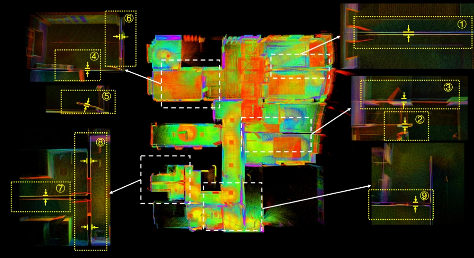
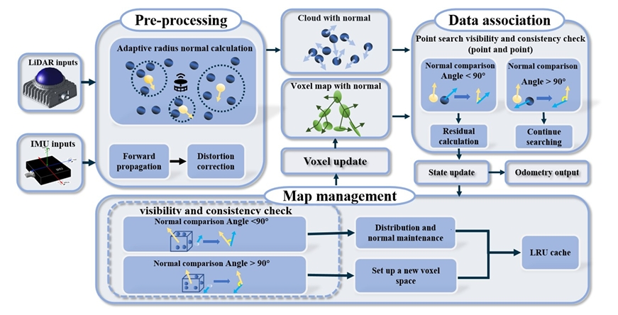
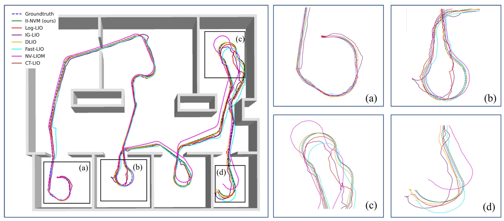

<div align="center">
  <h1>II-NVM</h1>
  <h2>Enhancing Map Accuracy and Consistency with Normal Vector-Assisted Mapping</h2>
  <p><strong>This work has been accepted to <i> IEEE Robotics and Automation Letters (RA-L 2025)</i>.</strong></p>
  <br>

  [](https://github.com/chengwei0427/II-NVM)
  [](https://arxiv.org/abs/2504.08204)
  [](https://www.youtube.com/watch?v=qso39uI7l38)
  <!-- [](https://ieeexplore.ieee.org/document/10966190) -->

  
</div>

<!-- <div align="center">
    <h2><strong>II-NVM: Enhancing Map Accuracy and Consistency with Normal Vector-Assisted Mapping</strong></h2>
</div>

<div align="center">
    <a href="https://github.com/chengwei0427" target='_blank'>Chengwei Zhao</a><sup>#,1,2</sup>&nbsp;&nbsp;&nbsp;
    <a href="https://github.com/bojackhomeman" target='_blank'>Yixuan Li</a><sup>#,1</sup>&nbsp;&nbsp;&nbsp;
    <a href="https://orcid.org/" target='_blank'>Yina Jian</a><sup>3</sup>&nbsp;&nbsp;&nbsp;
    <a href="https://github.com/jiejie567" target='_blank'>Jie Xu</a><sup>*,4</sup>&nbsp;&nbsp;&nbsp;
    <a href="https://orcid.org/" target='_blank'>Linji Wang</a><sup>4</sup>&nbsp;&nbsp;&nbsp;
    <a href="https://github.com/lian-yue0515" target='_blank'>Yongxin Ma</a><sup>4</sup>
    <a href="https://orcid.org/" target='_blank'>Xinglai Jin</a><sup>2</sup>
    </br></br>
    <sup>1</sup>XJTU&nbsp;&nbsp;&nbsp;
    <sup>2</sup>Qisheng Intelligent Techology&nbsp;&nbsp;&nbsp;
    <sup>3</sup>COLUMBIA&nbsp;&nbsp;&nbsp;
    <sup>4</sup> NTU
    </br></br>
    #-co-first authors            *-corresponding authors
</div> -->

<p align="center">
  
  <br><em>illustrates a real-world scenario where the double-sided mapping issue arises, presenting examples of both erroneous and correct mappings.</em>
</p>

<p align="center">
  
  <br><em>Demonstration of real-world scenarios where mapping results of walls and doors in a real scenario.</em>
</p>
<p align="center">
  
  <br><em>System Overview: II-NVM Pipeline</em>
</p>

<p align="center">
  
  <br><em>Comparison of localization estimates from different algorithms.</em>
</p>

## Abstract
SLAM technology plays a crucial role in indoor mapping and localization. A common challenge in indoor environments is the “double-sided mapping issue”, where closely positioned walls, doors, and other surfaces are mistakenly identified as a single plane, significantly hindering map accuracy and consistency. To addressing this issue this paper introduces a SLAM approach that ensures accurate mapping using normal vector consistency. We enhance the voxel map structure to store both point cloud data and normal vector information, enabling the system to evaluate consistency during nearest neighbor searches and map updates. This process distinguishes between the front and back sides of surfaces, preventing incorrect point-to-plane constraints. Moreover, we implement an adaptive radius KD-tree search method that dynamically adjusts the search radius based on the local density of the point cloud, thereby enhancing the accuracy of normal vector calculations. To further improve real time performance and storage efficiency, we incorporate a Least Recently Used (LRU) cache strategy, which facilitates efficient incremental updates of the voxel map. The code is released as open-source and validated in both simulated environments and real indoor scenarios. Experimental results demonstrate that this approach effectively resolves the “double-sided mapping issue” and significantly improves mapping precision. Additionally, we have developed and open-sourced the first simulation and real world dataset specifically tailored for the “double-sided mapping issue”.

**Contributors**: [Chengwei Zhao](https://github.com/chengwei0427), [Yixuan Li](https://github.com/bojackhomeman), Yina Jian, [Jie Xu](https://github.com/jiejie567), Linji Wang, Yongxin Ma, Xinglai Jin 


## Note:
The code is currently being refactored, and we will open-source it in the near future.


## :memo: News
* **[10/04/2025]**: II-NVM is accepted to IEEE Robotics and Automation Letters.
* **[11/04/2025]**: Submitted the paper to arxiv.


##  📁 II-NVM Dataset

Our data has been uploaded to [OneDrive](https://entuedu-my.sharepoint.com/:f:/g/personal/jie_xu_staff_main_ntu_edu_sg/Ekeh2Zi-lbdOgkuxB4D1M8EBJaZAwX00rhJwaZrFHqQ70Q?e=cz42sW). For users in mainland China, we provide a [Baidu Cloud](https://pan.baidu.com/s/1HvK_M_f96uGb4USGiEX7Ow), with the extraction code: 5678.


## 📖 Citation

If your like our projects, please cite us and support us with a star 🌟.
We kindly recommend to cite [our paper](https://ieeexplore.ieee.org/document/10966190) if you find this library useful:


```
@ARTICLE{10966190,
  author={Zhao, Chengwei and Li, Yixuan and Jian, Yina and Xu, Jie and Wang, Linji and Ma, Yongxin and Jin, Xinglai},
  journal={IEEE Robotics and Automation Letters}, 
  title={II-NVM: Enhancing Map Accuracy and Consistency with Normal Vector-Assisted Mapping}, 
  year={2025},
  volume={},
  number={},
  pages={1-8},
  keywords={Vectors;Point cloud compression;Accuracy;Simultaneous localization and mapping;Laser radar;Real-time systems;Pose estimation;Odometry;Data mining;Artificial intelligence;SLAM;Mapping;indoor;double-sided mapping issue;normal vector-assisted},
  doi={10.1109/LRA.2025.3561568}}

```